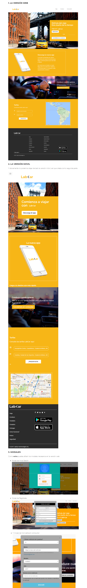

# LAB-CAR 

**Herramientas:**

* CSS
* HTML
* BOOPSTRAP 

**Objetivo:**
* Realizar una página web responsive, tanto para movil como para deskop utilizando Boopstrap.

**Procedimiento:**

 * Se instaló boopstrap en mi ordenador, para de esa madera cumplir con lo solicitado y usar dicha herramienta para la elaboracion de la pagina web solicitada.
 Luego de ello se realizo la estructura en mi editor de texto, y se comenzó a maquetear y a ubicar las clases boopstrap que necesitaria, y a la par se trabjaba con el css, para ir dandole mas estilo a mi página.

**Producto final:**

Aquí observamos el producto a lograr.

